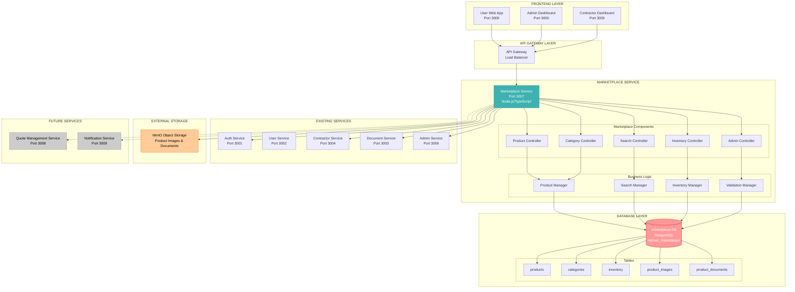
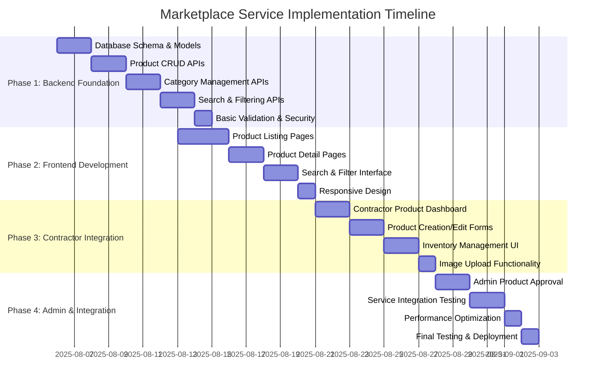
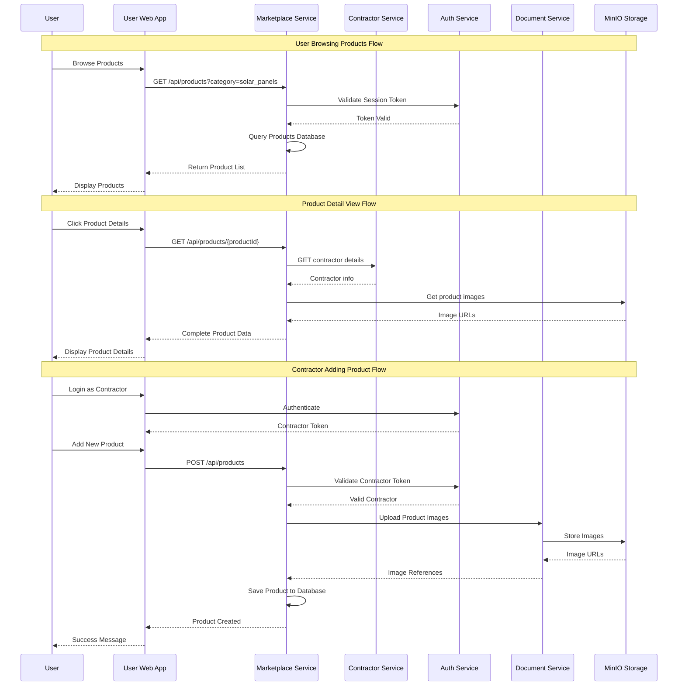
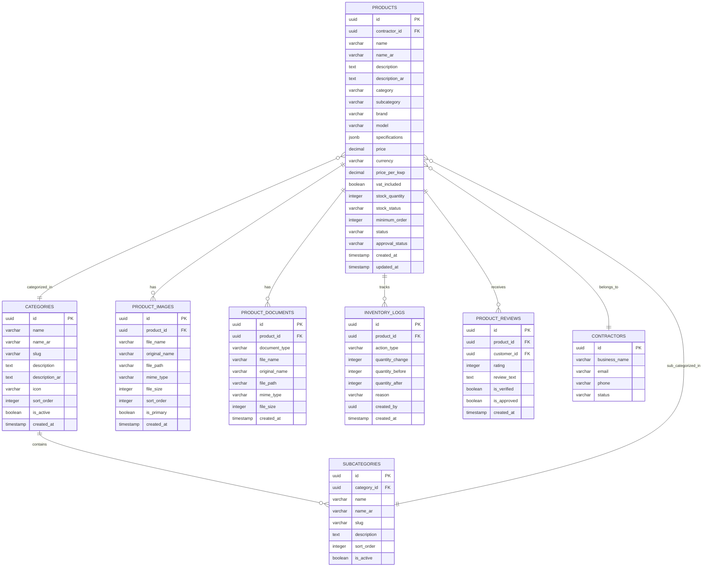
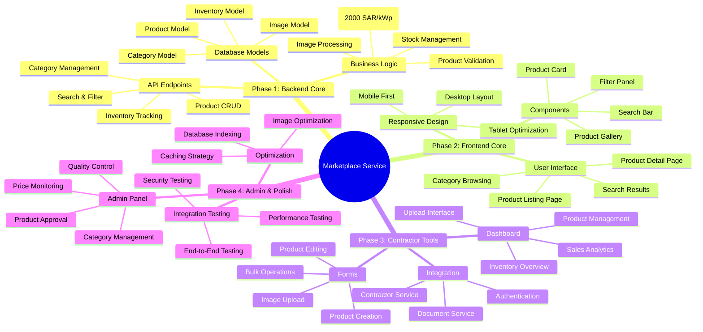
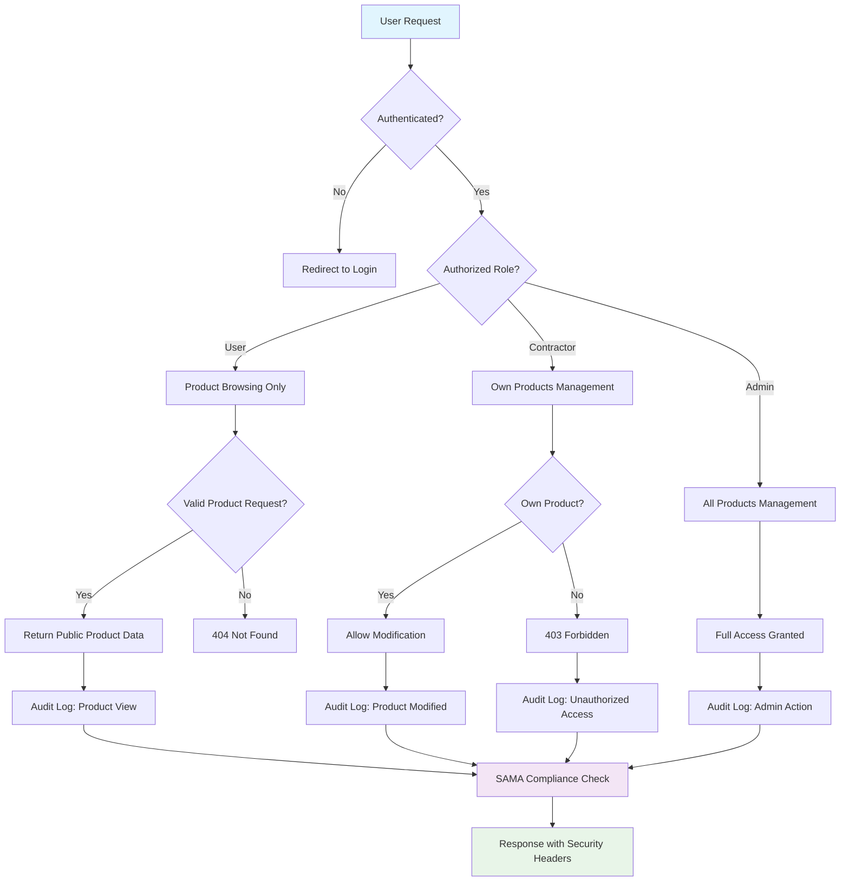
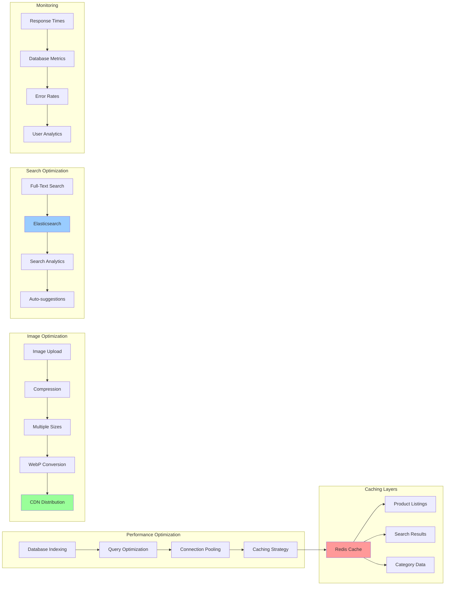

# 🛒 MARKETPLACE SERVICE - Implementation Plan & Architecture

## 📊 **SYSTEM ARCHITECTURE DIAGRAM**



---

## 🗓️ **IMPLEMENTATION TIMELINE DIAGRAM**



---

## 🔄 **SERVICE INTEGRATION FLOW DIAGRAM**



---

## 🏗️ **DATABASE SCHEMA DIAGRAM**



---

## 🎯 **FEATURE IMPLEMENTATION PHASES**



---

## 🔐 **SECURITY & COMPLIANCE FLOW**



---

## 📊 **PERFORMANCE & SCALABILITY PLAN**



---

## 🧪 **TESTING STRATEGY DIAGRAM**

```mermaid
pyramid
    title Testing Pyramid - Marketplace Service
    
    section Unit Tests
        Product Model Tests
        Category Model Tests
        Search Logic Tests
        Validation Tests
        Business Logic Tests
    
    section Integration Tests
        Database Operations
        Service-to-Service APIs
        Authentication Flow
        File Upload Flow
        Search Functionality
    
    section E2E Tests
        Product Browsing Journey
        Contractor Product Management
        Admin Approval Workflow
        Mobile Responsiveness
        Cross-browser Testing
    
    section Performance Tests
        Load Testing (1000+ concurrent)
        Database Performance
        Search Performance
        Image Loading Speed
```

---

## 🔄 **DEPLOYMENT STRATEGY**

```mermaid
flowchart LR
    subgraph "Development"
        A[Local Development] --> B[Unit Tests]
        B --> C[Integration Tests]
    end
    
    subgraph "CI/CD Pipeline"
        C --> D[GitHub Actions]
        D --> E[Build & Test]
        E --> F[Security Scan]
        F --> G[Code Quality Check]
    end
    
    subgraph "Staging Environment"
        G --> H[Deploy to Staging]
        H --> I[E2E Tests]
        I --> J[Performance Tests]
        J --> K[User Acceptance Testing]
    end
    
    subgraph "Production"
        K --> L[Blue-Green Deployment]
        L --> M[Health Checks]
        M --> N[Monitor & Alert]
    end
    
    subgraph "Rollback Strategy"
        N --> O{Issues Detected?}
        O -->|Yes| P[Automatic Rollback]
        O -->|No| Q[Deployment Success]
    end
    
    style D fill:#4CAF50
    style L fill:#2196F3
    style P fill:#f44336
```



---

## 📋 **IMPLEMENTATION CHECKLIST**

### **Phase 1: Backend Foundation (Week 1)**
- [ ] **Day 1-2**: Database schema creation
  - [ ] Create PostgreSQL database
  - [ ] Design and implement tables
  - [ ] Set up relationships and indexes
  - [ ] Create migration scripts

- [ ] **Day 3-4**: Core API development  
  - [ ] Product CRUD endpoints
  - [ ] Category management APIs
  - [ ] Search and filtering APIs
  - [ ] Authentication middleware

- [ ] **Day 5**: Validation and security
  - [ ] Input validation rules
  - [ ] Price validation (2000 SAR/kWp)
  - [ ] Authorization checks
  - [ ] Audit logging

### **Phase 2: Frontend Development (Week 2)**
- [ ] **Day 1-3**: Core UI components
  - [ ] Product listing page
  - [ ] Product detail page
  - [ ] Search interface
  - [ ] Filter components

- [ ] **Day 4-5**: Integration and polish
  - [ ] API integration
  - [ ] Responsive design
  - [ ] Loading states
  - [ ] Error handling

### **Phase 3: Contractor Integration (Week 3)**
- [ ] **Day 1-2**: Contractor dashboard
  - [ ] Product management interface
  - [ ] Inventory tracking
  - [ ] Upload functionality

- [ ] **Day 3-4**: Advanced features
  - [ ] Bulk operations
  - [ ] Image galleries
  - [ ] Product analytics

- [ ] **Day 5**: Admin integration
  - [ ] Approval workflows
  - [ ] Quality control
  - [ ] Final testing

---

## 🎯 **SUCCESS METRICS**

### **Technical KPIs**
- **API Response Time**: < 200ms for product listings
- **Search Performance**: < 500ms for complex searches
- **Image Load Time**: < 2 seconds for product galleries
- **Database Query Time**: < 50ms average
- **Uptime Target**: 99.9%

### **Business KPIs** 
- **Product Catalog Size**: 100+ products by launch
- **Contractor Participation**: 80% of verified contractors
- **Search Success Rate**: 95% of searches return results
- **User Engagement**: Average 2+ minutes on product pages
- **Mobile Usage**: 60%+ of traffic from mobile devices

### **SAMA Compliance KPIs**
- **Price Compliance**: 100% adherence to 2000 SAR/kWp
- **Audit Trail Coverage**: 100% of admin actions logged
- **Security Scan Results**: Zero critical vulnerabilities
- **Data Protection**: 100% PII encryption compliance

---

## 🚀 **NEXT STEPS**

1. **🏗️ START PHASE 1**: Begin database schema and backend API development
2. **👥 TEAM ASSIGNMENT**: Assign 3-4 developers (2 backend, 2 frontend)
3. **🔧 ENVIRONMENT SETUP**: Configure development and testing environments
4. **📊 MONITORING SETUP**: Implement logging and performance monitoring
5. **🧪 TESTING FRAMEWORK**: Set up automated testing pipeline

**Estimated Total Duration**: 3 weeks
**Team Size**: 4 developers
**Dependencies**: Existing services must remain stable
**Risk Level**: Low-Medium (well-defined requirements)

This plan provides a comprehensive roadmap for implementing the Marketplace Service with clear phases, dependencies, and success criteria. Each component is designed to integrate seamlessly with existing services while maintaining SAMA compliance and MVP requirements.